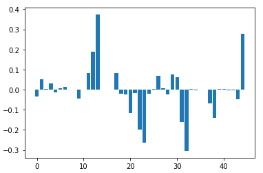

# Capstone: Artificial Intelligence & Machine Learning
<b>Author: Daniel Wallace</b> 
Professional Certificate 
Berkeley, School of Engineering  
Berkeley, Haas School of Business 
UNIVERSITY OF CALIFORNIA, BERKELEY

<h2>Executive Brief:</h2> In this capstone, my goal is to do the heavy lifting of the project. I will explore my data source, test a few of the techniques, and come up with a solution or answer to my research problem. HTML version of notebook is with full set of visuals <a href="https://federalcomputing.com/capstoneAIML.html" target="_blank">is available here. </a>  <i> Due to GitHub's restrictions on upload file size, the Jupyter notebook has been reduced to a manageable size which will display in the browser. For a complete view including all visuals, please see the link <a href="https://federalcomputing.com/capstoneAIML.html" target="_blank">previously cited.</a> </i>

<h3>Research Problem</h3>

Hospitals are slammed with readmissions of patients. Specifically, data has been collected related to readmisssion as well as other outcomes pertaining to patients with diabetes. What can we do to reduce these readmissions and possibly improve patient health? 
<h3>Modeling Techniques To Be Used:</h3>
Multi-class classification using one of Logistic Regression or Decision Trees, Counterfactual technique
<h3>Expected Results</h3>

I am expecting to find what are the important things (features) that contribute to a return/readmission. From this point, perhaps use the counterfactual explanations technique to determine what can possibly be changed to get a readmission score of False.
<h3>Why This Question Is Important</h3>

This question is important because individuals are being readmitted to hospitals for the same things. Particularly, in this case, these are diabetic patients. Diabetes is a morbidity that needs to be watched closely and coupled with other issues that can lead to complexity and/or fatality. Thus, perhaps we can provide recommendations on changes to 1) keep the patient healthier and 2) keep readmissions down amongst diabetic patients.

<h3>Important Findings</h3>
The use of counterfactual explanations was very critical to our desired outcome and has yielded favorably to our expected results. We leveraged DICE ML and were able to identify what needs to happen in order to reduce the chance of a diabetic patient being readmitted within 60 days after their original encounter. Some of our important findings include <i>(but not limited to)</i>: 
+ There are clinicial diagnosis that are actionable. A patient's primary care physician and/or endocrinologist should seek to relieve the patient of this diagnosis where possible. Perhaps there is better care or treatement that can be given to bring the patient to wellness and away from this diagnosis. 
+ Some drugs being used to managed a patient's blood sugar levels may not be optimal. Our counterfactual explanations modeling is able to robustly identify another drug that may provide better efficacy in blood sugar level management. 

<h3>Suggestions For Next Steps</h3>
Wellness of diabetic patients is a goal that modern medicine is aiming to achieve and make equitable for patients of all backgrounds. Through the use of Artificial Intelligence & Machine Learning, we have shown where we can achieve ground-breaking intelligence into improving patient care and wellness. In addition to Counterfactual Explanations, we can make use of a technique called <a href="https://christophm.github.io/interpretable-ml-book/shapley.html" target="_blank">Shapley Values</a>. Herein, a prediction can be explained by assuming that each feature value of the instance is a "player" in a game where the prediction is the payout. Shapley values tell us how to fairly distribute the "payout" among features. In this use case, perhaps we can explore where features within our diabetic patient dataset can be adjusted, where practical in a medical sense, to offer an alternative way towards wellness. Perhaps, Shapely values can suggest not to put so much weight on feature A or feature C, but instead- consider placing weight and attention to feature F. This would be a great area to explorer. 

Notwithstanding, gaps remain. There are social factors that ultimately influence both short-term and long-term health of patients. As you will see in our dataset and visuals, the lion's share of records belong to a single racial group. Traditionally, medicine has been developed and tested with bias to this same racial group. In order to deliver equitable care, modern medicine must include medicine research that considers "...the genetic factors that underlie varying responses to medicines observed among different ethnic and racial groups." With this consideration being made and incorporated into pharmaceutical treatment, our deliverables using counterfactual explnations will also change, for the betterment of all! 

 [Reference: <a href="https://www.ncbi.nlm.nih.gov/pmc/articles/PMC2594139/" target="_blank">NATIONAL INSTITUTE OF HEALTH (NIH), National Library of Medicine, National Center for Biotechnology Information, Journal of the National Medical Association; 2002 Oct; 94 )10 Suppl): 1-26. </a> ]

 

<h3>Data Source</h3>

https://archive.ics.uci.edu/ml/datasets/diabetes+130-us+hospitals+for+years+1999-2008 (Links to an external site.) - This data was donated in 2014 and is a collection of the past 6 years.

  
Our dataset is comprised of various features including demographics, relevant emergency room encounter information, medical drug data, etc. Our features are listed below.  

<h3>Features:</h3>

+ <b>race</b></b> - The race of the patient
+ <b>gender</b> - The gender of the patient (some marked as unknown)
+ <b>age</b> - The age of the patient
+ <b>admission_type_id</b> - Integer identifier corresponding to 9 distinct values, for example, emergency, urgent, elective, newborn, and not available
+ <b>discharge_disposition_id</b> - Integer identifier corresponding to 29 distinct values, for example, discharged to home, expired, and not available
+ <b>admission_source_id</b> - Integer identifier corresponding to 21 distinct values, for example, physician referral, emergency room, and transfer from a hospital
+ <b>time_in_hospital</b> - Integer number of days between admission and discharge
+ <b>medical_specialty</b> - Integer identifier of a specialty of the admitting physician, corresponding to 84 distinct values, for example, cardiology, internal medicine, family/general practice, and surgeon
+ <b>num_lab_procedures</b> - Number of lab tests performed during the encounter
+ <b>num_procedures</b> - Number of procedures (other than lab tests) performed during the encounter
+ <b>num_medications</b> - Number of distinct generic names administered during the encounter
+ <b>number_outpatient</b> - Number of outpatient visits of the patient in the year preceding the encounter
+ <b>number_emergency</b> - Number of emergency visits of the patient in the year preceding the encounter
+ <b>number_inpatient</b> - Number of inpatient visits of the patient in the year preceding the encounter
+ <b>diag_1</b> - The primary diagnosis (coded as first three digits of ICD9); 848 distinct values
+ <b>diag_2</b> - Secondary diagnosis (coded as first three digits of ICD9); 923 distinct values
+ <b>diag_3</b> - Additional secondary diagnosis (coded as first three digits of ICD9); 954 distinct values
+ <b>number_diagnoses</b> - Number of diagnoses entered to the system 0%
+ <b>max_glu_serum</b> - Indicates the range of the result or if the test was not taken. Values: “>200,” “>300,” “normal,” and “none” if not measured
+ <b>A1Cresult</b> - Indicates the range of the result or if the test was not taken. Values: “>8” if the result was greater than 8%, “>7” if the result was greater than 7% but less than 8%, “normal” if the result was less than 7%, and “none” if not measured.
+ <b>metformin</b> - medical drug
+ <b>repaglinide</b> - medical drug
+ <b>nateglinide</b> - medical drug
+ <b>chlorpropamide</b> - medical drug
+ <b>glimepiride</b> - medical drug
+ <b>acetohexamide</b> - medical drug
+ <b>glipizide</b> - medical drug
+ <b>glyburide</b> - medical drug
+ <b>tolbutamide</b> - medical drug
+ <b>pioglitazone</b> - medical drug
+ <b>rosiglitazone</b> - medical drug
+ <b>acarbose</b> - medical drug
+ <b>miglitol</b> - medical drug
+ <b>troglitazone</b> - medical drug
+ <b>tolazamide</b> - medical drug
+ <b>examide</b> - medical drug
+ <b>citoglipton</b> - medical drug
+ <b>insulin</b> - medical drug
+ <b>glyburide-metformin</b> - medical drug
+ <b>glipizide-metformin</b> - medical drug
+ <b>glimepiride-pioglitazone</b> - medical drug
+ <b>metformin-rosiglitazone</b> - medical drug
+ <b>metformin-pioglitazone</b> - medical drug
+ <b>change</b> - Indicates if there was a change in diabetic medications (either dosage or generic name). Values: “change” and “no change”
+ <b>diabetesMed</b> - Indicates if there was any diabetic medication prescribed. Values: “yes” and “no”
  
 <h3>Understanding the Data</h3>
From our data source, we are presented with various data from over 10 years of clinical care at 130 US hospitals and integrated delivery networks. It includes over 40 features representing patient and hospital outcomes. Information was extracted from the database for encounters that satisfied the following criteria:

+ It is an inpatient encounter (a hospital admission).
+ It is a diabetic encounter, that is, one during which any kind of diabetes was entered to the system as a diagnosis.
+ The length of stay was at least 1 day and at most 14 days.
+ Laboratory tests were performed during the encounter.
+ Medications were administered during the encounter.
+ The data contains such attributes as patient number, race, gender, age, admission type, time in hospital, medical specialty of admitting physician, number of lab test performed, HbA1c test result, diagnosis, number of medication, diabetic medications, number of outpatient, inpatient, and emergency visits in the year before the hospitalization, etc.

  
<h2>Modeling</h2> 
A baseline analysis: 
Training time :[0.0029990673065185547] 
Training accuracy :[0.4976837554045707] 
Test accuracy :[0.49924664264657714] 
Accuracy score : Not Yet Available 
AUC score : Not Yet Available  
#################LOGISTIC REGRESSION ANALYSIS##########

Training time :3.8975634574890137 
Training accuracy :0.6180582851367287 
Test accuracy :0.6188994431706518 
Accuracy score : 0.6188994431706518 
AUC score : 0.6034773037012175 

######################################################  
 
  
 <h3>Feature Importance</h3>
Feature: race 	 Score:-0.033796467119041725
 Feature: gender 	 Score:0.05220811772492702
 Feature: age 	 Score:0.0029344954582298266
 Feature: admission_type_id 	 Score:0.032138882815709854
 Feature: discharge_disposition_id 	 Score:-0.012756074107160375
 Feature: admission_source_id 	 Score:0.005697368221586632
 Feature: time_in_hospital 	 Score:0.015309280096100903
 Feature: medical_specialty 	 Score:0.0009692045401855414
 Feature: num_lab_procedures 	 Score:0.0009561158077616839
 Feature: num_procedures 	 Score:-0.04584900082060058
 Feature: num_medications 	 Score:0.0009861661339249123
 Feature: number_outpatient 	 Score:0.08235667848348943
 Feature: number_emergency 	 Score:0.1888097939190253
 Feature: number_inpatient 	 Score:0.3728662559579259
 Feature: diag_1 	 Score:-0.00013084404297845518
 Feature: diag_2 	 Score:-0.00016948616423528032
 Feature: diag_3 	 Score:3.229928653600553e-05
 Feature: number_diagnoses 	 Score:0.08312833535252362
 Feature: max_glu_serum 	 Score:-0.0191027671164415
 Feature: A1Cresult 	 Score:-0.02281927899061262
 Feature: metformin 	 Score:-0.11773066366763427
 Feature: repaglinide 	 Score:-0.016584307605706474
 Feature: nateglinide 	 Score:-0.19847540350258402
 Feature: chlorpropamide 	 Score:-0.2624410900601061
 Feature: glimepiride 	 Score:-0.02035639009589943
 Feature: acetohexamide 	 Score:0.004290645238704124
 Feature: glipizide 	 Score:0.06904377139404178
 Feature: glyburide 	 Score:0.007883757005958742
 Feature: tolbutamide 	 Score:-0.023482659033740666
 Feature: pioglitazone 	 Score:0.0760129295032895
 Feature: rosiglitazone 	 Score:0.06253838495541769
 Feature: acarbose 	 Score:-0.16133545826556323
 Feature: miglitol 	 Score:-0.3045983331251128
 Feature: troglitazone 	 Score:0.004864037064982501
 Feature: tolazamide 	 Score:-0.00474502797746427
 Feature: examide 	 Score:0.0
 Feature: citoglipton 	 Score:0.0
 Feature: insulin 	 Score:-0.0677520106092102
 Feature: glyburide-metformin 	 Score:-0.14107438654274135
 Feature: glipizide-metformin 	 Score:0.004826525999850238
 Feature: glimepiride-pioglitazone 	 Score:0.003183159044823325
 Feature: metformin-rosiglitazone 	 Score:-0.0030582987827478575
 Feature: metformin-pioglitazone 	 Score:-0.0028793596105040455
 Feature: change 	 Score:-0.046693629295805776
 Feature: diabetesMed 	 Score:0.2760422737557418
 <b>Feature importance:</b> 
  

  
<h3>Decision Tree Coefficients</h3>
 
 

	
	

<h1 style='color:black;font-family:Calibri;font-size:14.0pt;font-weight:800;
font-style:normal'>Counterfactual Explanations</h1> 

Using counterfactual explanations, we leverage DICE ML made available to us <a href="https://github.com/interpretml/DiCE" target="_blank">here</a> - we were able to identify what needs to happen to reduce the chance of a diabetic patient being readmitted within 60 days after their original encounter. In our table below we can see the following: 	
+ There is a suggestion of the Number of Procedures be elevated. However, we may discard this as we do not want to cause harm to patients with unnecessary procedures.
+ There is a suggestion at Diagnosis 2 be modified. As recommended by our model, the patient's primary care physician and/or endrocrinologist should seek to relieve the patient of this diagnosis where possible. Perhaps there is better care or treatment that can be given to bring patient to wellness, away from this diagnosis.
+ There is a suggestion that the medical drug Troglitazone by leveraged where it is safe for use, and as approved by the physician. The model is suggesting that use of this drug may affect the outcome of readmittance. 	

  

<table border=0 cellpadding=0 cellspacing=0 width=612 style='border-collapse:
 collapse;table-layout:fixed;width:460pt'>
 <col width=161 style='mso-width-source:userset;mso-width-alt:5888;width:121pt'>
 <col class=xl707922 width=117 style='mso-width-source:userset;mso-width-alt:
 4278;width:88pt'>
 <col class=xl707922 width=214 style='mso-width-source:userset;mso-width-alt:
 7826;width:161pt'>
 <col class=xl657922 width=120 style='mso-width-source:userset;mso-width-alt:
 4388;width:90pt'>
 <tr height=21 style='height:15.75pt'>
  <td height=21 class=xl747922 width=161 style='height:15.75pt;width:121pt'>&nbsp;</td>
  <td class=xl757922 width=117 style='width:88pt'>Original Outcome</td>
  <td colspan=2 class=xl767922 width=334 style='border-right:1.0pt solid black;
  width:251pt'>Diverse Counterfactual Outcome</td>
 </tr>

<tr height=21 style='height:15.75pt'>
  <td height=21 class=xl787922 width=161 style='height:15.75pt;width:121pt;
  overflow:hidden;padding-bottom:2px;padding-top:2px'>&nbsp;</td>
  <td class=xl717922 width=117 style='width:88pt;overflow:hidden;padding-bottom:
  2px;padding-top:2px' data-sheets-value="{&quot;1&quot;:3,&quot;3&quot;:1}">READMITTED</td>
  <td class=xl687922 width=214 style='border-top:none;width:161pt;overflow:
  hidden;padding-bottom:2px;padding-top:2px' data-sheets-value="{&quot;1&quot;:3,&quot;3&quot;:0}">READMITTED</td>
  <td class=xl797922 width=120 style='border-top:none;border-left:none;
  width:90pt;overflow:hidden;padding-bottom:2px;padding-top:2px'
      data-sheets-value="{&quot;1&quot;:3,&quot;3&quot;:0}">READMITTED</td>
</tr>
 <tr height=21 style='height:15.75pt'>
  <td height=21 class=xl807922 width=161 style='height:15.75pt;border-top:none;
  width:121pt;overflow:hidden;padding-bottom:2px;padding-top:2px'
      data-sheets-value="{&quot;1&quot;:2,&quot;2&quot;:&quot;readmitted&quot;}"><b>Readmitted</b></td>
  <td class=xl727922 width=117 style='border-top:none;width:88pt;overflow:hidden;
  padding-bottom:2px;padding-top:2px' data-sheets-value="{&quot;1&quot;:3,&quot;3&quot;:1}"><b>TRUE</b></td>
  <td class=xl697922 width=214 style='border-top:none;width:161pt;overflow:
  hidden;padding-bottom:2px;padding-top:2px' data-sheets-value="{&quot;1&quot;:3,&quot;3&quot;:0}"><b>FALSE</b></td>
  <td class=xl667922 width=120 style='border-top:none;border-left:none;
  width:90pt;overflow:hidden;padding-bottom:2px;padding-top:2px'
  data-sheets-value="{&quot;1&quot;:3,&quot;3&quot;:0}"><b>FALSE</b></td>
 </tr>
 <tr height=21 style='height:15.75pt'>
  <td height=21 class=xl787922 width=161 style='height:15.75pt;border-top:none;
  width:121pt;overflow:hidden;padding-bottom:2px;padding-top:2px'
  data-sheets-value="{&quot;1&quot;:2,&quot;2&quot;:&quot;gender&quot;}">gender</td>
  <td class=xl727922 width=117 style='border-top:none;width:88pt;overflow:hidden;
  padding-bottom:2px;padding-top:2px' data-sheets-value="{&quot;1&quot;:3,&quot;3&quot;:2}">2</td>
  <td class=xl697922 width=214 style='border-top:none;width:161pt;overflow:
  hidden;padding-bottom:2px;padding-top:2px' data-sheets-value="{&quot;1&quot;:3,&quot;3&quot;:2}">2</td>
  <td class=xl667922 width=120 style='border-top:none;border-left:none;
  width:90pt;overflow:hidden;padding-bottom:2px;padding-top:2px'
  data-sheets-value="{&quot;1&quot;:3,&quot;3&quot;:2}">2</td>
 </tr>
 <tr height=21 style='height:15.75pt'>
  <td height=21 class=xl787922 width=161 style='height:15.75pt;border-top:none;
  width:121pt;overflow:hidden;padding-bottom:2px;padding-top:2px'
  data-sheets-value="{&quot;1&quot;:2,&quot;2&quot;:&quot;age&quot;}">age</td>
  <td class=xl727922 width=117 style='border-top:none;width:88pt;overflow:hidden;
  padding-bottom:2px;padding-top:2px' data-sheets-value="{&quot;1&quot;:3,&quot;3&quot;:65}">65</td>
  <td class=xl697922 width=214 style='border-top:none;width:161pt;overflow:
  hidden;padding-bottom:2px;padding-top:2px' data-sheets-value="{&quot;1&quot;:3,&quot;3&quot;:65}">65</td>
  <td class=xl667922 width=120 style='border-top:none;border-left:none;
  width:90pt;overflow:hidden;padding-bottom:2px;padding-top:2px'
  data-sheets-value="{&quot;1&quot;:3,&quot;3&quot;:65}">65</td>
 </tr>
 <tr height=21 style='height:15.75pt'>
  <td height=21 class=xl787922 width=161 style='height:15.75pt;border-top:none;
  width:121pt;overflow:hidden;padding-bottom:2px;padding-top:2px'
  data-sheets-value="{&quot;1&quot;:2,&quot;2&quot;:&quot;admission_type_id&quot;}">admission_type_id</td>
  <td class=xl727922 width=117 style='border-top:none;width:88pt;overflow:hidden;
  padding-bottom:2px;padding-top:2px' data-sheets-value="{&quot;1&quot;:3,&quot;3&quot;:1}">1</td>
  <td class=xl697922 width=214 style='border-top:none;width:161pt;overflow:
  hidden;padding-bottom:2px;padding-top:2px' data-sheets-value="{&quot;1&quot;:3,&quot;3&quot;:1}">1</td>
  <td class=xl667922 width=120 style='border-top:none;border-left:none;
  width:90pt;overflow:hidden;padding-bottom:2px;padding-top:2px'
  data-sheets-value="{&quot;1&quot;:3,&quot;3&quot;:1}">1</td>
 </tr>
 <tr height=21 style='height:15.75pt'>
  <td height=21 class=xl787922 width=161 style='height:15.75pt;border-top:none;
  width:121pt;overflow:hidden;padding-bottom:2px;padding-top:2px'
  data-sheets-value="{&quot;1&quot;:2,&quot;2&quot;:&quot;discharge_disposition_id&quot;}">discharge_disposition_id</td>
  <td class=xl727922 width=117 style='border-top:none;width:88pt;overflow:hidden;
  padding-bottom:2px;padding-top:2px' data-sheets-value="{&quot;1&quot;:3,&quot;3&quot;:1}">1</td>
  <td class=xl697922 width=214 style='border-top:none;width:161pt;overflow:
  hidden;padding-bottom:2px;padding-top:2px' data-sheets-value="{&quot;1&quot;:3,&quot;3&quot;:1}">1</td>
  <td class=xl667922 width=120 style='border-top:none;border-left:none;
  width:90pt;overflow:hidden;padding-bottom:2px;padding-top:2px'
  data-sheets-value="{&quot;1&quot;:3,&quot;3&quot;:1}">1</td>
 </tr>
 <tr height=21 style='height:15.75pt'>
  <td height=21 class=xl787922 width=161 style='height:15.75pt;border-top:none;
  width:121pt;overflow:hidden;padding-bottom:2px;padding-top:2px'
  data-sheets-value="{&quot;1&quot;:2,&quot;2&quot;:&quot;admission_source_id&quot;}">admission_source_id</td>
  <td class=xl727922 width=117 style='border-top:none;width:88pt;overflow:hidden;
  padding-bottom:2px;padding-top:2px' data-sheets-value="{&quot;1&quot;:3,&quot;3&quot;:7}">7</td>
  <td class=xl697922 width=214 style='border-top:none;width:161pt;overflow:
  hidden;padding-bottom:2px;padding-top:2px' data-sheets-value="{&quot;1&quot;:3,&quot;3&quot;:7}">7</td>
  <td class=xl667922 width=120 style='border-top:none;border-left:none;
  width:90pt;overflow:hidden;padding-bottom:2px;padding-top:2px'
  data-sheets-value="{&quot;1&quot;:3,&quot;3&quot;:7}">7</td>
 </tr>
 <tr height=21 style='height:15.75pt'>
  <td height=21 class=xl787922 width=161 style='height:15.75pt;border-top:none;
  width:121pt;overflow:hidden;padding-bottom:2px;padding-top:2px'
  data-sheets-value="{&quot;1&quot;:2,&quot;2&quot;:&quot;time_in_hospital&quot;}">time_in_hospital</td>
  <td class=xl727922 width=117 style='border-top:none;width:88pt;overflow:hidden;
  padding-bottom:2px;padding-top:2px' data-sheets-value="{&quot;1&quot;:3,&quot;3&quot;:4}">4</td>
  <td class=xl697922 width=214 style='border-top:none;width:161pt;overflow:
  hidden;padding-bottom:2px;padding-top:2px' data-sheets-value="{&quot;1&quot;:3,&quot;3&quot;:4}">4</td>
  <td class=xl667922 width=120 style='border-top:none;border-left:none;
  width:90pt;overflow:hidden;padding-bottom:2px;padding-top:2px'
  data-sheets-value="{&quot;1&quot;:3,&quot;3&quot;:4}">4</td>
 </tr>
 <tr height=21 style='height:15.75pt'>
  <td height=21 class=xl787922 width=161 style='height:15.75pt;border-top:none;
  width:121pt;overflow:hidden;padding-bottom:2px;padding-top:2px'
  data-sheets-value="{&quot;1&quot;:2,&quot;2&quot;:&quot;medical_specialty&quot;}">medical_specialty</td>
  <td class=xl727922 width=117 style='border-top:none;width:88pt;overflow:hidden;
  padding-bottom:2px;padding-top:2px' data-sheets-value="{&quot;1&quot;:3,&quot;3&quot;:71}">71</td>
  <td class=xl697922 width=214 style='border-top:none;width:161pt;overflow:
  hidden;padding-bottom:2px;padding-top:2px' data-sheets-value="{&quot;1&quot;:3,&quot;3&quot;:71}">71</td>
  <td class=xl667922 width=120 style='border-top:none;border-left:none;
  width:90pt;overflow:hidden;padding-bottom:2px;padding-top:2px'
  data-sheets-value="{&quot;1&quot;:3,&quot;3&quot;:71}">71</td>
 </tr>
 <tr height=21 style='height:15.75pt'>
  <td height=21 class=xl787922 width=161 style='height:15.75pt;border-top:none;
  width:121pt;overflow:hidden;padding-bottom:2px;padding-top:2px'
  data-sheets-value="{&quot;1&quot;:2,&quot;2&quot;:&quot;num_lab_procedures&quot;}">num_lab_procedures</td>
  <td class=xl727922 width=117 style='border-top:none;width:88pt;overflow:hidden;
  padding-bottom:2px;padding-top:2px' data-sheets-value="{&quot;1&quot;:3,&quot;3&quot;:37}">37</td>
  <td class=xl697922 width=214 style='border-top:none;width:161pt;overflow:
  hidden;padding-bottom:2px;padding-top:2px' data-sheets-value="{&quot;1&quot;:3,&quot;3&quot;:37}">37</td>
  <td class=xl667922 width=120 style='border-top:none;border-left:none;
  width:90pt;overflow:hidden;padding-bottom:2px;padding-top:2px'
  data-sheets-value="{&quot;1&quot;:3,&quot;3&quot;:37}">37</td>
 </tr>
 <tr height=21 style='height:15.75pt'>
  <td height=21 class=xl787922 width=161 style='height:15.75pt;border-top:none;
  width:121pt;overflow:hidden;padding-bottom:2px;padding-top:2px'
  data-sheets-value="{&quot;1&quot;:2,&quot;2&quot;:&quot;num_procedures&quot;}"><b>num_procedures</b></td>
  <td class=xl727922 width=117 style='border-top:none;width:88pt;overflow:hidden;
  padding-bottom:2px;padding-top:2px' data-sheets-value="{&quot;1&quot;:3,&quot;3&quot;:0}"><b>0</b></td>
  <td class=xl737922 width=214 style='border-top:none;width:161pt;overflow:
  hidden;padding-bottom:2px;padding-top:2px;' data-sheets-value="{&quot;1&quot;:3,&quot;3&quot;:6}"><b>6</b></td>
  <td class=xl667922 width=120 style='border-top:none;border-left:none;
  width:90pt;overflow:hidden;padding-bottom:2px;padding-top:2px'
  data-sheets-value="{&quot;1&quot;:3,&quot;3&quot;:0}"><b>0</b></td>
 </tr>
 <tr height=21 style='height:15.75pt'>
  <td height=21 class=xl787922 width=161 style='height:15.75pt;border-top:none;
  width:121pt;overflow:hidden;padding-bottom:2px;padding-top:2px'
  data-sheets-value="{&quot;1&quot;:2,&quot;2&quot;:&quot;num_medications&quot;}">num_medications</td>
  <td class=xl727922 width=117 style='border-top:none;width:88pt;overflow:hidden;
  padding-bottom:2px;padding-top:2px' data-sheets-value="{&quot;1&quot;:3,&quot;3&quot;:15}">15</td>
  <td class=xl697922 width=214 style='border-top:none;width:161pt;overflow:
  hidden;padding-bottom:2px;padding-top:2px' data-sheets-value="{&quot;1&quot;:3,&quot;3&quot;:15}">15</td>
  <td class=xl667922 width=120 style='border-top:none;border-left:none;
  width:90pt;overflow:hidden;padding-bottom:2px;padding-top:2px'
  data-sheets-value="{&quot;1&quot;:3,&quot;3&quot;:15}">15</td>
 </tr>
 <tr height=21 style='height:15.75pt'>
  <td height=21 class=xl787922 width=161 style='height:15.75pt;border-top:none;
  width:121pt;overflow:hidden;padding-bottom:2px;padding-top:2px'
  data-sheets-value="{&quot;1&quot;:2,&quot;2&quot;:&quot;number_outpatient&quot;}">number_outpatient</td>
  <td class=xl727922 width=117 style='border-top:none;width:88pt;overflow:hidden;
  padding-bottom:2px;padding-top:2px' data-sheets-value="{&quot;1&quot;:3,&quot;3&quot;:0}">0</td>
  <td class=xl697922 width=214 style='border-top:none;width:161pt;overflow:
  hidden;padding-bottom:2px;padding-top:2px' data-sheets-value="{&quot;1&quot;:3,&quot;3&quot;:0}">0</td>
  <td class=xl667922 width=120 style='border-top:none;border-left:none;
  width:90pt;overflow:hidden;padding-bottom:2px;padding-top:2px'
  data-sheets-value="{&quot;1&quot;:3,&quot;3&quot;:0}">0</td>
 </tr>
 <tr height=21 style='height:15.75pt'>
  <td height=21 class=xl787922 width=161 style='height:15.75pt;border-top:none;
  width:121pt;overflow:hidden;padding-bottom:2px;padding-top:2px'
  data-sheets-value="{&quot;1&quot;:2,&quot;2&quot;:&quot;number_emergency&quot;}">number_emergency</td>
  <td class=xl727922 width=117 style='border-top:none;width:88pt;overflow:hidden;
  padding-bottom:2px;padding-top:2px' data-sheets-value="{&quot;1&quot;:3,&quot;3&quot;:0}">0</td>
  <td class=xl697922 width=214 style='border-top:none;width:161pt;overflow:
  hidden;padding-bottom:2px;padding-top:2px' data-sheets-value="{&quot;1&quot;:3,&quot;3&quot;:0}">0</td>
  <td class=xl667922 width=120 style='border-top:none;border-left:none;
  width:90pt;overflow:hidden;padding-bottom:2px;padding-top:2px'
  data-sheets-value="{&quot;1&quot;:3,&quot;3&quot;:0}">0</td>
 </tr>
 <tr height=21 style='height:15.75pt'>
  <td height=21 class=xl787922 width=161 style='height:15.75pt;border-top:none;
  width:121pt;overflow:hidden;padding-bottom:2px;padding-top:2px'
  data-sheets-value="{&quot;1&quot;:2,&quot;2&quot;:&quot;number_inpatient&quot;}">number_inpatient</td>
  <td class=xl727922 width=117 style='border-top:none;width:88pt;overflow:hidden;
  padding-bottom:2px;padding-top:2px' data-sheets-value="{&quot;1&quot;:3,&quot;3&quot;:3}">3</td>
  <td class=xl697922 width=214 style='border-top:none;width:161pt;overflow:
  hidden;padding-bottom:2px;padding-top:2px' data-sheets-value="{&quot;1&quot;:3,&quot;3&quot;:3}">3</td>
  <td class=xl667922 width=120 style='border-top:none;border-left:none;
  width:90pt;overflow:hidden;padding-bottom:2px;padding-top:2px'
  data-sheets-value="{&quot;1&quot;:3,&quot;3&quot;:3}">3</td>
 </tr>
 <tr height=21 style='height:15.75pt'>
  <td height=21 class=xl787922 width=161 style='height:15.75pt;border-top:none;
  width:121pt;overflow:hidden;padding-bottom:2px;padding-top:2px'
  data-sheets-value="{&quot;1&quot;:2,&quot;2&quot;:&quot;diag_1&quot;}">diag_1</td>
  <td class=xl727922 width=117 style='border-top:none;width:88pt;overflow:hidden;
  padding-bottom:2px;padding-top:2px' data-sheets-value="{&quot;1&quot;:3,&quot;3&quot;:329}">329</td>
  <td class=xl697922 width=214 style='border-top:none;width:161pt;overflow:
  hidden;padding-bottom:2px;padding-top:2px' data-sheets-value="{&quot;1&quot;:3,&quot;3&quot;:329}">329</td>
  <td class=xl667922 width=120 style='border-top:none;border-left:none;
  width:90pt;overflow:hidden;padding-bottom:2px;padding-top:2px'
  data-sheets-value="{&quot;1&quot;:3,&quot;3&quot;:329}">329</td>
 </tr>
 <tr height=21 style='height:15.75pt'>
  <td height=21 class=xl787922 width=161 style='height:15.75pt;border-top:none;
  width:121pt;overflow:hidden;padding-bottom:2px;padding-top:2px'
  data-sheets-value="{&quot;1&quot;:2,&quot;2&quot;:&quot;diag_2&quot;}"><b>diag_2</b></td>
  <td class=xl727922 width=117 style='border-top:none;width:88pt;overflow:hidden;
  padding-bottom:2px;padding-top:2px' data-sheets-value="{&quot;1&quot;:3,&quot;3&quot;:333}"><b>333</b></td>
  <td class=xl697922 width=214 style='border-top:none;width:161pt;overflow:
  hidden;padding-bottom:2px;padding-top:2px' data-sheets-value="{&quot;1&quot;:3,&quot;3&quot;:333}"><b>333</b></td>
  <td class=xl817922 width=120 style='border-top:none;border-left:none;
  width:90pt;overflow:hidden;padding-bottom:2px;padding-top:2px'
  data-sheets-value="{&quot;1&quot;:3,&quot;3&quot;:672.6}"><b>672.6</b></td>
 </tr>
 <tr height=21 style='height:15.75pt'>
  <td height=21 class=xl787922 width=161 style='height:15.75pt;border-top:none;
  width:121pt;overflow:hidden;padding-bottom:2px;padding-top:2px'
  data-sheets-value="{&quot;1&quot;:2,&quot;2&quot;:&quot;diag_3&quot;}">diag_3</td>
  <td class=xl727922 width=117 style='border-top:none;width:88pt;overflow:hidden;
  padding-bottom:2px;padding-top:2px' data-sheets-value="{&quot;1&quot;:3,&quot;3&quot;:246}">246</td>
  <td class=xl697922 width=214 style='border-top:none;width:161pt;overflow:
  hidden;padding-bottom:2px;padding-top:2px' data-sheets-value="{&quot;1&quot;:3,&quot;3&quot;:246}">246</td>
  <td class=xl667922 width=120 style='border-top:none;border-left:none;
  width:90pt;overflow:hidden;padding-bottom:2px;padding-top:2px'
  data-sheets-value="{&quot;1&quot;:3,&quot;3&quot;:246}">246</td>
 </tr>
 <tr height=21 style='height:15.75pt'>
  <td height=21 class=xl787922 width=161 style='height:15.75pt;border-top:none;
  width:121pt;overflow:hidden;padding-bottom:2px;padding-top:2px'
  data-sheets-value="{&quot;1&quot;:2,&quot;2&quot;:&quot;number_diagnoses&quot;}">number_diagnoses</td>
  <td class=xl727922 width=117 style='border-top:none;width:88pt;overflow:hidden;
  padding-bottom:2px;padding-top:2px' data-sheets-value="{&quot;1&quot;:3,&quot;3&quot;:9}">9</td>
  <td class=xl697922 width=214 style='border-top:none;width:161pt;overflow:
  hidden;padding-bottom:2px;padding-top:2px' data-sheets-value="{&quot;1&quot;:3,&quot;3&quot;:9}">9</td>
  <td class=xl667922 width=120 style='border-top:none;border-left:none;
  width:90pt;overflow:hidden;padding-bottom:2px;padding-top:2px'
  data-sheets-value="{&quot;1&quot;:3,&quot;3&quot;:9}">9</td>
 </tr>
 <tr height=21 style='height:15.75pt'>
  <td height=21 class=xl787922 width=161 style='height:15.75pt;border-top:none;
  width:121pt;overflow:hidden;padding-bottom:2px;padding-top:2px'
  data-sheets-value="{&quot;1&quot;:2,&quot;2&quot;:&quot;max_glu_serum&quot;}">max_glu_serum</td>
  <td class=xl727922 width=117 style='border-top:none;width:88pt;overflow:hidden;
  padding-bottom:2px;padding-top:2px' data-sheets-value="{&quot;1&quot;:3,&quot;3&quot;:2}">2</td>
  <td class=xl697922 width=214 style='border-top:none;width:161pt;overflow:
  hidden;padding-bottom:2px;padding-top:2px' data-sheets-value="{&quot;1&quot;:3,&quot;3&quot;:2}">2</td>
  <td class=xl667922 width=120 style='border-top:none;border-left:none;
  width:90pt;overflow:hidden;padding-bottom:2px;padding-top:2px'
  data-sheets-value="{&quot;1&quot;:3,&quot;3&quot;:2}">2</td>
 </tr>
 <tr height=21 style='height:15.75pt'>
  <td height=21 class=xl787922 width=161 style='height:15.75pt;border-top:none;
  width:121pt;overflow:hidden;padding-bottom:2px;padding-top:2px'
  data-sheets-value="{&quot;1&quot;:2,&quot;2&quot;:&quot;A1Cresult&quot;}">A1Cresult</td>
  <td class=xl727922 width=117 style='border-top:none;width:88pt;overflow:hidden;
  padding-bottom:2px;padding-top:2px' data-sheets-value="{&quot;1&quot;:3,&quot;3&quot;:2}">2</td>
  <td class=xl697922 width=214 style='border-top:none;width:161pt;overflow:
  hidden;padding-bottom:2px;padding-top:2px' data-sheets-value="{&quot;1&quot;:3,&quot;3&quot;:2}">2</td>
  <td class=xl667922 width=120 style='border-top:none;border-left:none;
  width:90pt;overflow:hidden;padding-bottom:2px;padding-top:2px'
  data-sheets-value="{&quot;1&quot;:3,&quot;3&quot;:2}">2</td>
 </tr>
 <tr height=21 style='height:15.75pt'>
  <td height=21 class=xl787922 width=161 style='height:15.75pt;border-top:none;
  width:121pt;overflow:hidden;padding-bottom:2px;padding-top:2px'
  data-sheets-value="{&quot;1&quot;:2,&quot;2&quot;:&quot;metformin&quot;}">metformin</td>
  <td class=xl727922 width=117 style='border-top:none;width:88pt;overflow:hidden;
  padding-bottom:2px;padding-top:2px' data-sheets-value="{&quot;1&quot;:3,&quot;3&quot;:2}">2</td>
  <td class=xl697922 width=214 style='border-top:none;width:161pt;overflow:
  hidden;padding-bottom:2px;padding-top:2px' data-sheets-value="{&quot;1&quot;:3,&quot;3&quot;:2}">2</td>
  <td class=xl667922 width=120 style='border-top:none;border-left:none;
  width:90pt;overflow:hidden;padding-bottom:2px;padding-top:2px'
  data-sheets-value="{&quot;1&quot;:3,&quot;3&quot;:2}">2</td>
 </tr>
 <tr height=21 style='height:15.75pt'>
  <td height=21 class=xl787922 width=161 style='height:15.75pt;border-top:none;
  width:121pt;overflow:hidden;padding-bottom:2px;padding-top:2px'
  data-sheets-value="{&quot;1&quot;:2,&quot;2&quot;:&quot;repaglinide&quot;}">repaglinide</td>
  <td class=xl727922 width=117 style='border-top:none;width:88pt;overflow:hidden;
  padding-bottom:2px;padding-top:2px' data-sheets-value="{&quot;1&quot;:3,&quot;3&quot;:2}">2</td>
  <td class=xl697922 width=214 style='border-top:none;width:161pt;overflow:
  hidden;padding-bottom:2px;padding-top:2px' data-sheets-value="{&quot;1&quot;:3,&quot;3&quot;:2}">2</td>
  <td class=xl667922 width=120 style='border-top:none;border-left:none;
  width:90pt;overflow:hidden;padding-bottom:2px;padding-top:2px'
  data-sheets-value="{&quot;1&quot;:3,&quot;3&quot;:2}">2</td>
 </tr>
 <tr height=21 style='height:15.75pt'>
  <td height=21 class=xl787922 width=161 style='height:15.75pt;border-top:none;
  width:121pt;overflow:hidden;padding-bottom:2px;padding-top:2px'
  data-sheets-value="{&quot;1&quot;:2,&quot;2&quot;:&quot;nateglinide&quot;}">nateglinide</td>
  <td class=xl727922 width=117 style='border-top:none;width:88pt;overflow:hidden;
  padding-bottom:2px;padding-top:2px' data-sheets-value="{&quot;1&quot;:3,&quot;3&quot;:1}">1</td>
  <td class=xl697922 width=214 style='border-top:none;width:161pt;overflow:
  hidden;padding-bottom:2px;padding-top:2px' data-sheets-value="{&quot;1&quot;:3,&quot;3&quot;:1}">1</td>
  <td class=xl667922 width=120 style='border-top:none;border-left:none;
  width:90pt;overflow:hidden;padding-bottom:2px;padding-top:2px'
  data-sheets-value="{&quot;1&quot;:3,&quot;3&quot;:1}">1</td>
 </tr>
 <tr height=21 style='height:15.75pt'>
  <td height=21 class=xl787922 width=161 style='height:15.75pt;border-top:none;
  width:121pt;overflow:hidden;padding-bottom:2px;padding-top:2px'
  data-sheets-value="{&quot;1&quot;:2,&quot;2&quot;:&quot;chlorpropamide&quot;}">chlorpropamide</td>
  <td class=xl727922 width=117 style='border-top:none;width:88pt;overflow:hidden;
  padding-bottom:2px;padding-top:2px' data-sheets-value="{&quot;1&quot;:3,&quot;3&quot;:1}">1</td>
  <td class=xl697922 width=214 style='border-top:none;width:161pt;overflow:
  hidden;padding-bottom:2px;padding-top:2px' data-sheets-value="{&quot;1&quot;:3,&quot;3&quot;:1}">1</td>
  <td class=xl667922 width=120 style='border-top:none;border-left:none;
  width:90pt;overflow:hidden;padding-bottom:2px;padding-top:2px'
  data-sheets-value="{&quot;1&quot;:3,&quot;3&quot;:1}">1</td>
 </tr>
 <tr height=21 style='height:15.75pt'>
  <td height=21 class=xl787922 width=161 style='height:15.75pt;border-top:none;
  width:121pt;overflow:hidden;padding-bottom:2px;padding-top:2px'
  data-sheets-value="{&quot;1&quot;:2,&quot;2&quot;:&quot;glimepiride&quot;}">glimepiride</td>
  <td class=xl727922 width=117 style='border-top:none;width:88pt;overflow:hidden;
  padding-bottom:2px;padding-top:2px' data-sheets-value="{&quot;1&quot;:3,&quot;3&quot;:1}">1</td>
  <td class=xl697922 width=214 style='border-top:none;width:161pt;overflow:
  hidden;padding-bottom:2px;padding-top:2px' data-sheets-value="{&quot;1&quot;:3,&quot;3&quot;:1}">1</td>
  <td class=xl667922 width=120 style='border-top:none;border-left:none;
  width:90pt;overflow:hidden;padding-bottom:2px;padding-top:2px'
  data-sheets-value="{&quot;1&quot;:3,&quot;3&quot;:1}">1</td>
 </tr>
 <tr height=21 style='height:15.75pt'>
  <td height=21 class=xl787922 width=161 style='height:15.75pt;border-top:none;
  width:121pt;overflow:hidden;padding-bottom:2px;padding-top:2px'
  data-sheets-value="{&quot;1&quot;:2,&quot;2&quot;:&quot;acetohexamide&quot;}">acetohexamide</td>
  <td class=xl727922 width=117 style='border-top:none;width:88pt;overflow:hidden;
  padding-bottom:2px;padding-top:2px' data-sheets-value="{&quot;1&quot;:3,&quot;3&quot;:0}">0</td>
  <td class=xl697922 width=214 style='border-top:none;width:161pt;overflow:
  hidden;padding-bottom:2px;padding-top:2px' data-sheets-value="{&quot;1&quot;:3,&quot;3&quot;:0}">0</td>
  <td class=xl667922 width=120 style='border-top:none;border-left:none;
  width:90pt;overflow:hidden;padding-bottom:2px;padding-top:2px'
  data-sheets-value="{&quot;1&quot;:3,&quot;3&quot;:0}">0</td>
 </tr>
 <tr height=21 style='height:15.75pt'>
  <td height=21 class=xl787922 width=161 style='height:15.75pt;border-top:none;
  width:121pt;overflow:hidden;padding-bottom:2px;padding-top:2px'
  data-sheets-value="{&quot;1&quot;:2,&quot;2&quot;:&quot;glipizide&quot;}">glipizide</td>
  <td class=xl727922 width=117 style='border-top:none;width:88pt;overflow:hidden;
  padding-bottom:2px;padding-top:2px' data-sheets-value="{&quot;1&quot;:3,&quot;3&quot;:1}">1</td>
  <td class=xl697922 width=214 style='border-top:none;width:161pt;overflow:
  hidden;padding-bottom:2px;padding-top:2px' data-sheets-value="{&quot;1&quot;:3,&quot;3&quot;:1}">1</td>
  <td class=xl667922 width=120 style='border-top:none;border-left:none;
  width:90pt;overflow:hidden;padding-bottom:2px;padding-top:2px'
  data-sheets-value="{&quot;1&quot;:3,&quot;3&quot;:1}">1</td>
 </tr>
 <tr height=21 style='height:15.75pt'>
  <td height=21 class=xl787922 width=161 style='height:15.75pt;border-top:none;
  width:121pt;overflow:hidden;padding-bottom:2px;padding-top:2px'
  data-sheets-value="{&quot;1&quot;:2,&quot;2&quot;:&quot;glyburide&quot;}">glyburide</td>
  <td class=xl727922 width=117 style='border-top:none;width:88pt;overflow:hidden;
  padding-bottom:2px;padding-top:2px' data-sheets-value="{&quot;1&quot;:3,&quot;3&quot;:1}">1</td>
  <td class=xl697922 width=214 style='border-top:none;width:161pt;overflow:
  hidden;padding-bottom:2px;padding-top:2px' data-sheets-value="{&quot;1&quot;:3,&quot;3&quot;:1}">1</td>
  <td class=xl667922 width=120 style='border-top:none;border-left:none;
  width:90pt;overflow:hidden;padding-bottom:2px;padding-top:2px'
  data-sheets-value="{&quot;1&quot;:3,&quot;3&quot;:1}">1</td>
 </tr>
 <tr height=21 style='height:15.75pt'>
  <td height=21 class=xl787922 width=161 style='height:15.75pt;border-top:none;
  width:121pt;overflow:hidden;padding-bottom:2px;padding-top:2px'
  data-sheets-value="{&quot;1&quot;:2,&quot;2&quot;:&quot;tolbutamide&quot;}">tolbutamide</td>
  <td class=xl727922 width=117 style='border-top:none;width:88pt;overflow:hidden;
  padding-bottom:2px;padding-top:2px' data-sheets-value="{&quot;1&quot;:3,&quot;3&quot;:0}">0</td>
  <td class=xl697922 width=214 style='border-top:none;width:161pt;overflow:
  hidden;padding-bottom:2px;padding-top:2px' data-sheets-value="{&quot;1&quot;:3,&quot;3&quot;:0}">0</td>
  <td class=xl667922 width=120 style='border-top:none;border-left:none;
  width:90pt;overflow:hidden;padding-bottom:2px;padding-top:2px'
  data-sheets-value="{&quot;1&quot;:3,&quot;3&quot;:0}">0</td>
 </tr>
 <tr height=21 style='height:15.75pt'>
  <td height=21 class=xl787922 width=161 style='height:15.75pt;border-top:none;
  width:121pt;overflow:hidden;padding-bottom:2px;padding-top:2px'
  data-sheets-value="{&quot;1&quot;:2,&quot;2&quot;:&quot;pioglitazone&quot;}">pioglitazone</td>
  <td class=xl727922 width=117 style='border-top:none;width:88pt;overflow:hidden;
  padding-bottom:2px;padding-top:2px' data-sheets-value="{&quot;1&quot;:3,&quot;3&quot;:1}">1</td>
  <td class=xl697922 width=214 style='border-top:none;width:161pt;overflow:
  hidden;padding-bottom:2px;padding-top:2px' data-sheets-value="{&quot;1&quot;:3,&quot;3&quot;:1}">1</td>
  <td class=xl667922 width=120 style='border-top:none;border-left:none;
  width:90pt;overflow:hidden;padding-bottom:2px;padding-top:2px'
  data-sheets-value="{&quot;1&quot;:3,&quot;3&quot;:1}">1</td>
 </tr>
 <tr height=21 style='height:15.75pt'>
  <td height=21 class=xl787922 width=161 style='height:15.75pt;border-top:none;
  width:121pt;overflow:hidden;padding-bottom:2px;padding-top:2px'
  data-sheets-value="{&quot;1&quot;:2,&quot;2&quot;:&quot;rosiglitazone&quot;}">rosiglitazone</td>
  <td class=xl727922 width=117 style='border-top:none;width:88pt;overflow:hidden;
  padding-bottom:2px;padding-top:2px' data-sheets-value="{&quot;1&quot;:3,&quot;3&quot;:1}">1</td>
  <td class=xl697922 width=214 style='border-top:none;width:161pt;overflow:
  hidden;padding-bottom:2px;padding-top:2px' data-sheets-value="{&quot;1&quot;:3,&quot;3&quot;:1}">1</td>
  <td class=xl667922 width=120 style='border-top:none;border-left:none;
  width:90pt;overflow:hidden;padding-bottom:2px;padding-top:2px'
  data-sheets-value="{&quot;1&quot;:3,&quot;3&quot;:1}">1</td>
 </tr>
 <tr height=21 style='height:15.75pt'>
  <td height=21 class=xl787922 width=161 style='height:15.75pt;border-top:none;
  width:121pt;overflow:hidden;padding-bottom:2px;padding-top:2px'
  data-sheets-value="{&quot;1&quot;:2,&quot;2&quot;:&quot;acarbose&quot;}">acarbose</td>
  <td class=xl727922 width=117 style='border-top:none;width:88pt;overflow:hidden;
  padding-bottom:2px;padding-top:2px' data-sheets-value="{&quot;1&quot;:3,&quot;3&quot;:1}">1</td>
  <td class=xl697922 width=214 style='border-top:none;width:161pt;overflow:
  hidden;padding-bottom:2px;padding-top:2px' data-sheets-value="{&quot;1&quot;:3,&quot;3&quot;:1}">1</td>
  <td class=xl667922 width=120 style='border-top:none;border-left:none;
  width:90pt;overflow:hidden;padding-bottom:2px;padding-top:2px'
  data-sheets-value="{&quot;1&quot;:3,&quot;3&quot;:1}">1</td>
 </tr>
 <tr height=21 style='height:15.75pt'>
  <td height=21 class=xl787922 width=161 style='height:15.75pt;border-top:none;
  width:121pt;overflow:hidden;padding-bottom:2px;padding-top:2px'
  data-sheets-value="{&quot;1&quot;:2,&quot;2&quot;:&quot;miglitol&quot;}">miglitol</td>
  <td class=xl727922 width=117 style='border-top:none;width:88pt;overflow:hidden;
  padding-bottom:2px;padding-top:2px' data-sheets-value="{&quot;1&quot;:3,&quot;3&quot;:1}">1</td>
  <td class=xl697922 width=214 style='border-top:none;width:161pt;overflow:
  hidden;padding-bottom:2px;padding-top:2px' data-sheets-value="{&quot;1&quot;:3,&quot;3&quot;:1}">1</td>
  <td class=xl667922 width=120 style='border-top:none;border-left:none;
  width:90pt;overflow:hidden;padding-bottom:2px;padding-top:2px'
  data-sheets-value="{&quot;1&quot;:3,&quot;3&quot;:1}">1</td>
 </tr>
 <tr height=21 style='height:15.75pt'>
  <td height=21 class=xl787922 width=161 style='height:15.75pt;border-top:none;
  width:121pt;overflow:hidden;padding-bottom:2px;padding-top:2px'
  data-sheets-value="{&quot;1&quot;:2,&quot;2&quot;:&quot;troglitazone&quot;}"><b>troglitazone</b></td>
  <td class=xl727922 width=117 style='border-top:none;width:88pt;overflow:hidden;
  padding-bottom:2px;padding-top:2px' data-sheets-value="{&quot;1&quot;:3,&quot;3&quot;:0}"><b>0</b></td>
  <td class=xl737922 width=214 style='border-top:none;width:161pt;overflow:
  hidden;padding-bottom:2px;padding-top:2px' data-sheets-value="{&quot;1&quot;:3,&quot;3&quot;:1}"><b>1</b></td>
  <td class=xl667922 width=120 style='border-top:none;border-left:none;
  width:90pt;overflow:hidden;padding-bottom:2px;padding-top:2px'
  data-sheets-value="{&quot;1&quot;:3,&quot;3&quot;:0}"><b>0</b></td>
 </tr>
 <tr height=21 style='height:15.75pt'>
  <td height=21 class=xl787922 width=161 style='height:15.75pt;border-top:none;
  width:121pt;overflow:hidden;padding-bottom:2px;padding-top:2px'
  data-sheets-value="{&quot;1&quot;:2,&quot;2&quot;:&quot;tolazamide&quot;}">tolazamide</td>
  <td class=xl727922 width=117 style='border-top:none;width:88pt;overflow:hidden;
  padding-bottom:2px;padding-top:2px' data-sheets-value="{&quot;1&quot;:3,&quot;3&quot;:0}">0</td>
  <td class=xl697922 width=214 style='border-top:none;width:161pt;overflow:
  hidden;padding-bottom:2px;padding-top:2px' data-sheets-value="{&quot;1&quot;:3,&quot;3&quot;:0}">0</td>
  <td class=xl667922 width=120 style='border-top:none;border-left:none;
  width:90pt;overflow:hidden;padding-bottom:2px;padding-top:2px'
  data-sheets-value="{&quot;1&quot;:3,&quot;3&quot;:0}">0</td>
 </tr>
 <tr height=21 style='height:15.75pt'>
  <td height=21 class=xl787922 width=161 style='height:15.75pt;border-top:none;
  width:121pt;overflow:hidden;padding-bottom:2px;padding-top:2px'
  data-sheets-value="{&quot;1&quot;:2,&quot;2&quot;:&quot;examide&quot;}">examide</td>
  <td class=xl727922 width=117 style='border-top:none;width:88pt;overflow:hidden;
  padding-bottom:2px;padding-top:2px' data-sheets-value="{&quot;1&quot;:3,&quot;3&quot;:0}">0</td>
  <td class=xl697922 width=214 style='border-top:none;width:161pt;overflow:
  hidden;padding-bottom:2px;padding-top:2px' data-sheets-value="{&quot;1&quot;:3,&quot;3&quot;:0}">0</td>
  <td class=xl667922 width=120 style='border-top:none;border-left:none;
  width:90pt;overflow:hidden;padding-bottom:2px;padding-top:2px'
  data-sheets-value="{&quot;1&quot;:3,&quot;3&quot;:0}">0</td>
 </tr>
 <tr height=21 style='height:15.75pt'>
  <td height=21 class=xl787922 width=161 style='height:15.75pt;border-top:none;
  width:121pt;overflow:hidden;padding-bottom:2px;padding-top:2px'
  data-sheets-value="{&quot;1&quot;:2,&quot;2&quot;:&quot;citoglipton&quot;}">citoglipton</td>
  <td class=xl727922 width=117 style='border-top:none;width:88pt;overflow:hidden;
  padding-bottom:2px;padding-top:2px' data-sheets-value="{&quot;1&quot;:3,&quot;3&quot;:0}">0</td>
  <td class=xl697922 width=214 style='border-top:none;width:161pt;overflow:
  hidden;padding-bottom:2px;padding-top:2px' data-sheets-value="{&quot;1&quot;:3,&quot;3&quot;:0}">0</td>
  <td class=xl667922 width=120 style='border-top:none;border-left:none;
  width:90pt;overflow:hidden;padding-bottom:2px;padding-top:2px'
  data-sheets-value="{&quot;1&quot;:3,&quot;3&quot;:0}">0</td>
 </tr>
 <tr height=21 style='height:15.75pt'>
  <td height=21 class=xl787922 width=161 style='height:15.75pt;border-top:none;
  width:121pt;overflow:hidden;padding-bottom:2px;padding-top:2px'
  data-sheets-value="{&quot;1&quot;:2,&quot;2&quot;:&quot;insulin&quot;}">insulin</td>
  <td class=xl727922 width=117 style='border-top:none;width:88pt;overflow:hidden;
  padding-bottom:2px;padding-top:2px' data-sheets-value="{&quot;1&quot;:3,&quot;3&quot;:1}">1</td>
  <td class=xl697922 width=214 style='border-top:none;width:161pt;overflow:
  hidden;padding-bottom:2px;padding-top:2px' data-sheets-value="{&quot;1&quot;:3,&quot;3&quot;:1}">1</td>
  <td class=xl667922 width=120 style='border-top:none;border-left:none;
  width:90pt;overflow:hidden;padding-bottom:2px;padding-top:2px'
  data-sheets-value="{&quot;1&quot;:3,&quot;3&quot;:1}">1</td>
 </tr>
 <tr height=21 style='height:15.75pt'>
  <td height=21 class=xl787922 width=161 style='height:15.75pt;border-top:none;
  width:121pt;overflow:hidden;padding-bottom:2px;padding-top:2px'
  data-sheets-value="{&quot;1&quot;:2,&quot;2&quot;:&quot;glyburide-metformin&quot;}">glyburide-metformin</td>
  <td class=xl727922 width=117 style='border-top:none;width:88pt;overflow:hidden;
  padding-bottom:2px;padding-top:2px' data-sheets-value="{&quot;1&quot;:3,&quot;3&quot;:1}">1</td>
  <td class=xl697922 width=214 style='border-top:none;width:161pt;overflow:
  hidden;padding-bottom:2px;padding-top:2px' data-sheets-value="{&quot;1&quot;:3,&quot;3&quot;:1}">1</td>
  <td class=xl667922 width=120 style='border-top:none;border-left:none;
  width:90pt;overflow:hidden;padding-bottom:2px;padding-top:2px'
  data-sheets-value="{&quot;1&quot;:3,&quot;3&quot;:1}">1</td>
 </tr>
 <tr height=21 style='height:15.75pt'>
  <td height=21 class=xl787922 width=161 style='height:15.75pt;border-top:none;
  width:121pt;overflow:hidden;padding-bottom:2px;padding-top:2px'
  data-sheets-value="{&quot;1&quot;:2,&quot;2&quot;:&quot;glipizide-metformin&quot;}">glipizide-metformin</td>
  <td class=xl727922 width=117 style='border-top:none;width:88pt;overflow:hidden;
  padding-bottom:2px;padding-top:2px' data-sheets-value="{&quot;1&quot;:3,&quot;3&quot;:0}">0</td>
  <td class=xl697922 width=214 style='border-top:none;width:161pt;overflow:
  hidden;padding-bottom:2px;padding-top:2px' data-sheets-value="{&quot;1&quot;:3,&quot;3&quot;:0}">0</td>
  <td class=xl667922 width=120 style='border-top:none;border-left:none;
  width:90pt;overflow:hidden;padding-bottom:2px;padding-top:2px'
  data-sheets-value="{&quot;1&quot;:3,&quot;3&quot;:0}">0</td>
 </tr>
 <tr height=21 style='height:15.75pt'>
  <td height=21 class=xl787922 width=161 style='height:15.75pt;border-top:none;
  width:121pt;overflow:hidden;padding-bottom:2px;padding-top:2px'
  data-sheets-value="{&quot;1&quot;:2,&quot;2&quot;:&quot;glimepiride-pioglitazone&quot;}">glimepiride-pioglitazone</td>
  <td class=xl727922 width=117 style='border-top:none;width:88pt;overflow:hidden;
  padding-bottom:2px;padding-top:2px' data-sheets-value="{&quot;1&quot;:3,&quot;3&quot;:0}">0</td>
  <td class=xl697922 width=214 style='border-top:none;width:161pt;overflow:
  hidden;padding-bottom:2px;padding-top:2px' data-sheets-value="{&quot;1&quot;:3,&quot;3&quot;:0}">0</td>
  <td class=xl667922 width=120 style='border-top:none;border-left:none;
  width:90pt;overflow:hidden;padding-bottom:2px;padding-top:2px'
  data-sheets-value="{&quot;1&quot;:3,&quot;3&quot;:0}">0</td>
 </tr>
 <tr height=21 style='height:15.75pt'>
  <td height=21 class=xl787922 width=161 style='height:15.75pt;border-top:none;
  width:121pt;overflow:hidden;padding-bottom:2px;padding-top:2px'
  data-sheets-value="{&quot;1&quot;:2,&quot;2&quot;:&quot;metformin-rosiglitazone&quot;}">metformin-rosiglitazone</td>
  <td class=xl727922 width=117 style='border-top:none;width:88pt;overflow:hidden;
  padding-bottom:2px;padding-top:2px' data-sheets-value="{&quot;1&quot;:3,&quot;3&quot;:0}">0</td>
  <td class=xl697922 width=214 style='border-top:none;width:161pt;overflow:
  hidden;padding-bottom:2px;padding-top:2px' data-sheets-value="{&quot;1&quot;:3,&quot;3&quot;:0}">0</td>
  <td class=xl667922 width=120 style='border-top:none;border-left:none;
  width:90pt;overflow:hidden;padding-bottom:2px;padding-top:2px'
  data-sheets-value="{&quot;1&quot;:3,&quot;3&quot;:0}">0</td>
 </tr>
 <tr height=21 style='height:15.75pt'>
  <td height=21 class=xl787922 width=161 style='height:15.75pt;border-top:none;
  width:121pt;overflow:hidden;padding-bottom:2px;padding-top:2px'
  data-sheets-value="{&quot;1&quot;:2,&quot;2&quot;:&quot;metformin-pioglitazone&quot;}">metformin-pioglitazone</td>
  <td class=xl727922 width=117 style='border-top:none;width:88pt;overflow:hidden;
  padding-bottom:2px;padding-top:2px' data-sheets-value="{&quot;1&quot;:3,&quot;3&quot;:0}">0</td>
  <td class=xl697922 width=214 style='border-top:none;width:161pt;overflow:
  hidden;padding-bottom:2px;padding-top:2px' data-sheets-value="{&quot;1&quot;:3,&quot;3&quot;:0}">0</td>
  <td class=xl667922 width=120 style='border-top:none;border-left:none;
  width:90pt;overflow:hidden;padding-bottom:2px;padding-top:2px'
  data-sheets-value="{&quot;1&quot;:3,&quot;3&quot;:0}">0</td>
 </tr>
 <tr height=21 style='height:15.75pt'>
  <td height=21 class=xl787922 width=161 style='height:15.75pt;border-top:none;
  width:121pt;overflow:hidden;padding-bottom:2px;padding-top:2px'
  data-sheets-value="{&quot;1&quot;:2,&quot;2&quot;:&quot;change&quot;}">change</td>
  <td class=xl727922 width=117 style='border-top:none;width:88pt;overflow:hidden;
  padding-bottom:2px;padding-top:2px' data-sheets-value="{&quot;1&quot;:3,&quot;3&quot;:0}">0</td>
  <td class=xl697922 width=214 style='border-top:none;width:161pt;overflow:
  hidden;padding-bottom:2px;padding-top:2px' data-sheets-value="{&quot;1&quot;:3,&quot;3&quot;:0}">0</td>
  <td class=xl667922 width=120 style='border-top:none;border-left:none;
  width:90pt;overflow:hidden;padding-bottom:2px;padding-top:2px'
  data-sheets-value="{&quot;1&quot;:3,&quot;3&quot;:0}">0</td>
 </tr>
 <tr height=21 style='height:15.75pt'>
  <td height=21 class=xl827922 width=161 style='height:15.75pt;border-top:none;
  width:121pt;overflow:hidden;padding-bottom:2px;padding-top:2px'
  data-sheets-value="{&quot;1&quot;:2,&quot;2&quot;:&quot;diabetesMed&quot;}">diabetesMed</td>
  <td class=xl837922 width=117 style='border-top:none;width:88pt;overflow:hidden;
  padding-bottom:2px;padding-top:2px' data-sheets-value="{&quot;1&quot;:3,&quot;3&quot;:1}">1</td>
  <td class=xl847922 width=214 style='border-top:none;width:161pt;overflow:
  hidden;padding-bottom:2px;padding-top:2px' data-sheets-value="{&quot;1&quot;:3,&quot;3&quot;:1}">1</td>
  <td class=xl677922 width=120 style='border-top:none;border-left:none;
  width:90pt;overflow:hidden;padding-bottom:2px;padding-top:2px'
  data-sheets-value="{&quot;1&quot;:3,&quot;3&quot;:1}">1</td>
 </tr>
 <![if supportMisalignedColumns]>
 <tr height=0 style='display:none'>
  <td width=161 style='width:121pt'></td>
  <td width=117 style='width:88pt'></td>
  <td width=214 style='width:161pt'></td>
  <td width=120 style='width:90pt'></td>
 </tr>
 <![endif]>
</table>

 
